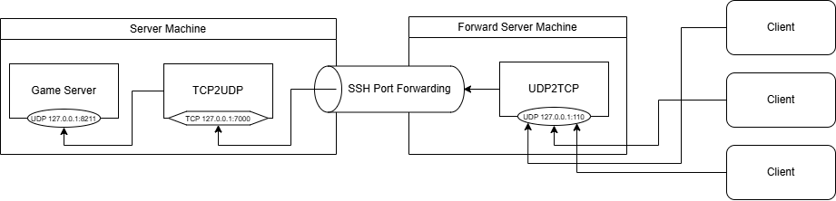

# SimpleUDPOverTCP

Forwarding UDP packets over TCP.

It is intended to be used in environments where only TCP packets can be forwarded and UDP packets cannot be sent, such
as SSH port forwarding.  
When transferring via TCP, the speed is slower than when sending UDP packets directly, and unexpected packet loss may
occur.  
At present, we have confirmed that it only works on the Palworld server, but we believe it will also work with other
games.

## How to Use



As shown in the diagram above, if you want to connect from the "Forward Server Machine" connected to the outside world
to the Game Server running on the "Server Machine" using SSH Port Forwarding, you will need to run this application on
both server machines.

The released Jar file is a Shadow Jar that contains all libraries, so it can be launched independently.

```
Java23 Directory\bin\java -jar simple-udp-over-tcp-1.0.0-all.jar -t tcp2udp -l 127.0.0.1:7000 -d 127.0.0.1:8211
```

Please execute with the following arguments.

### Server Machine Side

```
-t tcp2udp -l 127.0.0.1:7000 -d 127.0.0.1:8211
```

### Forward Server Machine Side

```
-t udp2tcp -l 127.0.0.1:110 -d 127.0.0.1:7000
```

If it starts up correctly, sending a UDP packet to 127.0.0.1:110 will forward the packet to 127.0.0.1:8211.

### Meaning of arguments
`-t`: Type (tcp2udp or udp2tcp)  
`-l`: Listen (Address:Port)  
`-d`: Dest (Address:Port)  
